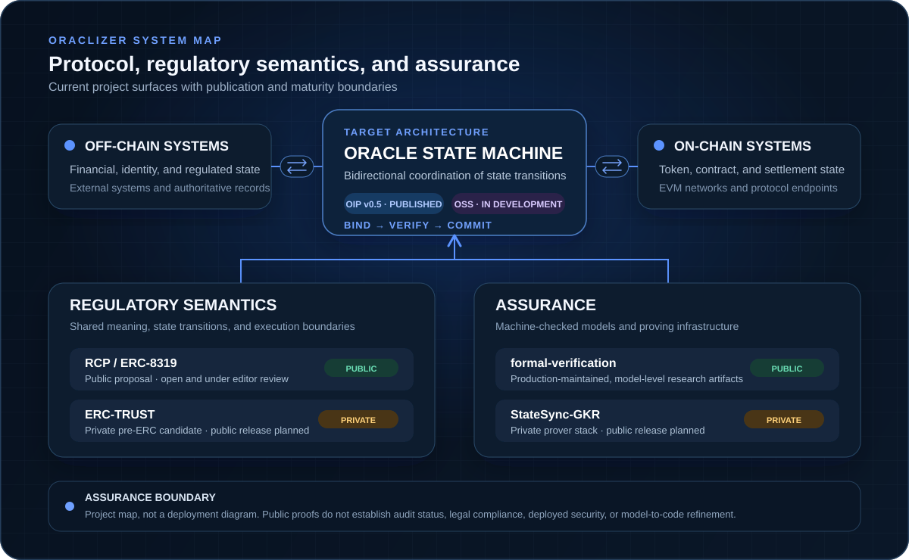
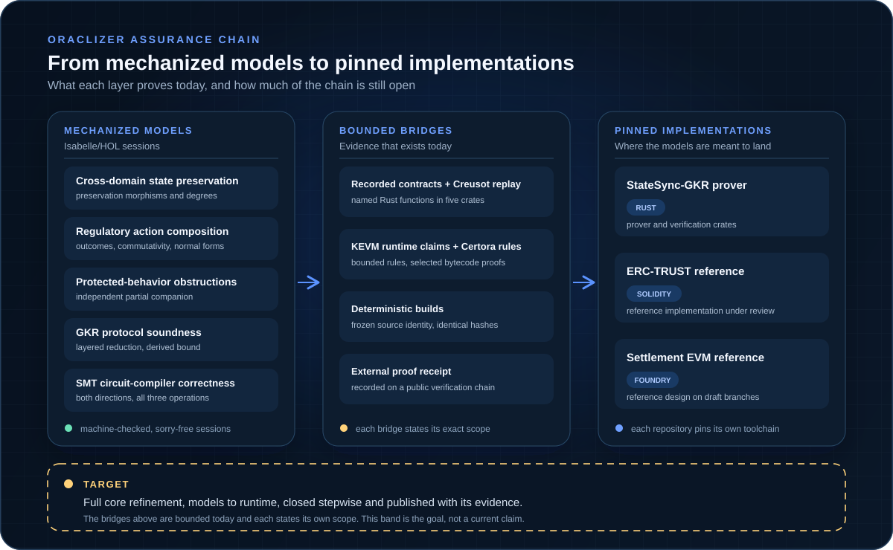

<picture>
  <source media="(prefers-color-scheme: dark)" srcset="./oraclizer_logo.svg">
  <source media="(prefers-color-scheme: light)" srcset="./oraclizer_logo_black.svg">
  
</picture>

### Formal, protocol, and proving foundations for cross-domain state synchronization

Oraclizer is building an oracle state machine that coordinates on-chain and
off-chain state transitions under explicit protocol, verification, and
regulatory boundaries.

[**Website**](https://oraclizer.io) ·
[**Research**](https://research.oraclizer.io) ·
[**Documentation**](https://docs.oraclizer.io) ·
[**Formal artifacts**](https://github.com/Oraclizer/formal-verification) ·
[**X**](https://x.com/Oraclizer)

[System map](#system-and-research-map) ·
[Repositories](#repository-portfolio) ·
[Standards](#protocols-and-standards) ·
[Publications](#published-research) ·
[Review](#review-and-contact)

> [!IMPORTANT]
> Oraclizer's public GitHub provides research, formal artifacts, and protocol
> specifications. Each repository defines its exact assurance boundary.

## Why state synchronization

Observation-oriented oracle designs move facts into a chain. Stateful assets
also require coordinated changes to ownership, restrictions, contractual
terms, and external records. Independent updates can leave participating
domains with different views of the same asset.

Oraclizer treats this as a state-machine problem. The target architecture
defines the required coupling between domains, binds related transitions,
verifies the transition against explicit rules, and records a result that can
be inspected and challenged. The work spans protocol specification, regulatory
semantics, mechanized models, and proving infrastructure.

## System and research map

  <picture>
    <source media="(max-width: 640px)" srcset="./assets/oraclizer-system-map-mobile.svg">
    
  </picture>

The diagram is a project map, not a deployment diagram. Its status labels are
part of the architecture: public research, published specifications, active
development, and private candidates are intentionally distinguished.

## Assurance chain

  <picture>
    <source media="(max-width: 640px)" srcset="./assets/org-assurance-chain-mobile.svg">
    
  </picture>

The chain reads left to right: machine-checked models, the bounded bridges
that carry evidence today, and the pinned implementations they are meant to
land on. The dashed band is the target, full core refinement from models to
runtime, closed stepwise and published with its evidence; it is a goal
statement, not a current claim.

## Repository portfolio

### Public now

| Repository | Scope | Current status |
| --- | --- | --- |
| [**formal-verification**](https://github.com/Oraclizer/formal-verification) | Machine-checked, model-level foundations for cross-domain state preservation and regulatory action composition in Isabelle/HOL, plus an independent protected-behavior obstruction companion | **Public, production-maintained research.** Reproducible sessions, integrity manifests, explicit assumptions, security reporting, contribution rules, governance, and citation metadata. It is not a production implementation or deployment. |

### Preparing for public release

The repositories below remain private today. These entries announce intended
future publication. They do not announce availability, a delivery date, audit
status, or production readiness, and no private repository link is exposed.

| Repository | Scope | Publication boundary |
| --- | --- | --- |
| **ERC-TRUST** | *Typed Regulatory Uniformity for Security Tokens*: typed, fail-closed regulatory actions and recomputable receipts for security-token implementations | **Private pre-ERC candidate.** Public release is planned after internal review. Unaudited and not for production. |
| **StateSync-GKR** | A Rust prover for sparse-Merkle state transitions built on Plonky3 primitives, with GKR and sumcheck mechanized in Isabelle/HOL | **Private development repository.** Public release is planned after internal review. |

Public visibility will be evaluated independently from a version tag, release,
deployment, audit, or standards-process milestone.

## Protocols and standards

| Work | Role | Public state |
| --- | --- | --- |
| [**OIP v0.5**](https://docs.oraclizer.io/oip-v05/oip-overview/) | Oracle Interoperability Protocol: message semantics, state transitions, routing, validation, errors, and conformance rules for state-machine implementations | **Published specification, prototype stage.** OIP is a specification; OSS is its reference implementation track. |
| [**RCP**](https://arxiv.org/abs/2603.29278) | Regulatory Compliance Protocol: a regulatory benchmark derived from 31 requirements across 15 global financial regulators | **Published research framework.** RCP organizes the requirements into five principles and defines a shared regulatory-action vocabulary. |
| [**ERC-8319**](https://github.com/ethereum/ERCs/pull/1848) | Standards Track ERC proposal for the RCP vocabulary and legal-effect semantics | **Open proposal under editor review.** The proposal is not merged and its status is separate from Oraclizer product development. |
| **ERC-TRUST** | A thin candidate extension connecting ERC-8319 semantics to typed execution, authorization, outcomes, and receipts | **Private pre-ERC work.** It has not been submitted as an ERC and remains subject to public review after release. |

## Published research

### Regulatory Compliance Protocol

**Jinwook Kim and Jonghun Hong.** *A Regulatory Compliance Protocol for Asset
Interoperability Between Traditional and Decentralized Finance in Tokenized
Capital Markets.*

[arXiv:2603.29278](https://arxiv.org/abs/2603.29278) ·
[SSRN:6538718](https://papers.ssrn.com/sol3/papers.cfm?abstract_id=6538718)

The paper presents RCP as a value-neutral benchmark for identifying which
regulatory requirements token standards cover, which they leave open, and
where supporting off-chain infrastructure remains necessary.

### Cross-Domain State Preservation

**Jinwook Kim.** *The Cross-Domain State Preservation Functor: A Mechanized
Theory of Regulatory State Synchronization in Isabelle/HOL.*

[arXiv:2604.03844](https://arxiv.org/abs/2604.03844) ·
[SSRN:6550359](https://papers.ssrn.com/sol3/papers.cfm?abstract_id=6550359) ·
[Mechanized artifacts](https://github.com/Oraclizer/formal-verification)

The paper and repository provide mechanized, model-level results under stated
definitions and assumptions. They do not establish adversarial network
liveness, implementation refinement, deployed-system correctness, or audit
status.

More protocol, proof, RWA, and economic research is indexed at
[research.oraclizer.io](https://research.oraclizer.io).

## Review and contact

Independent reproduction, counterexamples, assumption challenges, and scope
corrections are especially useful.

- Start with the [formal artifact catalog](https://github.com/Oraclizer/formal-verification#formal-artifact-catalog) and its [assurance boundary](https://github.com/Oraclizer/formal-verification#assurance-boundary).
- Use the repository's structured issue forms for public proof or documentation questions.
- Report sensitive vulnerabilities through the relevant repository's [security policy](https://github.com/Oraclizer/formal-verification/security/policy), never through a public issue.
- Read the [OIP v0.5 specification](https://docs.oraclizer.io/oip-v05/oip-overview/) for protocol semantics and conformance scope.
- Join the public standards discussion for [ERC-8319](https://ethereum-magicians.org/t/erc-8319-regulatory-compliance-protocol/28917).

General and research inquiries: [jay@oraclizer.io](mailto:jay@oraclizer.io)
